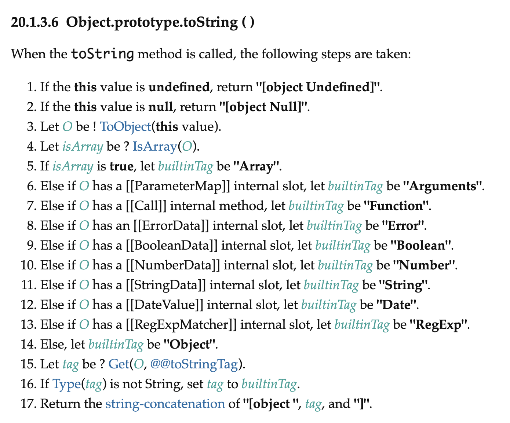

# vue2 中的 `shared` 工具函数

- `shared` 工具函数 [源码](https://github.com/vuejs/vue/blob/dev/src/shared/util.js)

参考好文：

- 若川：[初学者也能看懂的 Vue2 源码中那些实用的基础工具函数](https://juejin.cn/post/7024276020731592741)

这个目标比较明确，直接上源码，要求同样是**看明白，写清楚，做总结**

- Vue2 工具函数命名很规范，比如：`is` 判断，`to` 转换，`has` 是否有，让开发者一眼就能看出函数语意。
- 这些函数也非常单一，基本一个函数只做一件事。

先了解概况很重要。

开源项目一般都能在 README.md 或者 [.github/contributing.md](https://github.com/vuejs/vue/blob/dev/.github/CONTRIBUTING.md) 找到贡献指南。

## 源码分析

```js
/* @flow */
// vue2 采用的 flow 的类型声明, vue3 改为 TypeScript
// 可以跳过类型检查排查干扰，或直接看[打包后的 vue.js 14行到379行](https://github.com/vuejs/vue/blob/dev/dist/vue.js#L14-L379)
// 下文已去除类型检查

// 冻结对象。第一层无法修改。对象中也有判断是否冻结的方法。
// Object.isFrozen(emptyObject); // true
var emptyObject = Object.freeze({});

/*

JavaScript 中假值有 6 个, vue2 做了封装来准确判断

false
null
undefined
0
'' (空字符串)
NaN

*/

// These helpers produce better VM code in JS engines due to their
// explicitness and function inlining.
// 判断是否未定义
function isUndef (v) {
  return v === undefined || v === null
}

function isDef (v) {
  return v !== undefined && v !== null
}

function isTrue (v) {
  return v === true
}

function isFalse (v) {
  return v === false
}

/**
 * Check if value is primitive.
 * 判断是否是原始值，这里只用到了原始类型中的四种 [string, number, symbol, boolean]
 */
function isPrimitive (value) {
  return (
    typeof value === 'string' ||
    typeof value === 'number' ||
    // $flow-disable-line
    typeof value === 'symbol' ||
    typeof value === 'boolean'
  )
}

/**
 * Quick object check - this is primarily used to tell
 * objects from primitive values when we know the value
 * is a JSON-compliant type.
 *
 * 快速检查值是否符合 json 的类型，将对象和原始值区分开来
 * 这里没有区分 Array, Date 等类型，并不严格，具体还是看用途
 */
function isObject (obj) {
  return obj !== null && typeof obj === 'object'
}

/**
 * Get the raw type string of a value, e.g., [object Object].
 *
 * 转换成原始类型
 * Object.prototype.toString() 方法返回一个表示该对象的字符串。
 */
var _toString = Object.prototype.toString;
function toRawType (value) {
  return _toString.call(value).slice(8, -1)
}

// 示例
// console.log(toRawType('')) // 'String'
// console.log(toRawType()) // 'Undefined'

/**
 * Strict object type check. Only returns true
 * for plain JavaScript objects.
 *
 * 严格判断是否是纯对象 区别于上面的 isObject
 */
function isPlainObject (obj) {
  return _toString.call(obj) === '[object Object]'
}
// console.log(isObject([])) // true
// console.log(isPlainObject([])) // false
// console.log(isPlainObject({})) // true

// 判断正则
function isRegExp (v) {
  return _toString.call(v) === '[object RegExp]'
}

/**
 * Check if val is a valid array index.
 *
 * 判断是否是有效的数组索引 （要求是 自然数 或 自然数字符串，但不能溢出）
 */
function isValidArrayIndex (val) {
  var n = parseFloat(String(val));
  return n >= 0 && Math.floor(n) === n && isFinite(val)
}
// isFinite(Infinity);  // false
// isFinite(NaN);       // false
// isFinite(-Infinity); // false

// isFinite(0);         // true
// isFinite(2e64);      // true, 在更强壮的Number.isFinite(null)中将会得到false

// isFinite('0');       // true, 在更强壮的Number.isFinite('0')中将会得到false

// 判断是否是 Promise
function isPromise (val) {
  return (
    isDef(val) &&
    typeof val.then === 'function' &&
    typeof val.catch === 'function'
  )
}

/**
 * Convert a value to a string that is actually rendered.
 * 转换成字符串
 * null => ''
 * 是数组或者对象并且对象的 `toString` 方法是 `Object.prototype.toString`时，用 `JSON.stringify` 转换
 * 否则使用 String() 转换
 */
function toString (val) {
  return val == null
    ? ''
    : Array.isArray(val) || (isPlainObject(val) && val.toString === _toString)
      ? JSON.stringify(val, null, 2)
      : String(val)
}

/**
 * Convert an input value to a number for persistence.
 * If the conversion fails, return original string.
 * 转换为数字，如果转换失败，返回原值
 */
function toNumber (val) {
  var n = parseFloat(val);
  return isNaN(n) ? val : n
}

/**
 * Make a map and return a function for checking if a key
 * is in that map.
 *
 * 传入一个以逗号分隔的字符串，生成一个 `map`(键值对)，并且返回一个函数检测 `key` 值在不在这个 `map` 中。
 * 第二个参数是小写选项。
 */
function makeMap (
  str,
  expectsLowerCase
) {
  // Object.create(null) 没有原型链的空对象
  var map = Object.create(null);
  var list = str.split(',');
  for (var i = 0; i < list.length; i++) {
    map[list[i]] = true;
  }
  return expectsLowerCase
    ? function (val) { return map[val.toLowerCase()]; }
    : function (val) { return map[val]; }
}

/**
 * Check if a tag is a built-in tag.
 * 是否是内置 tag
 * 返回的函数，第二个参数不区分大小写
 */
var isBuiltInTag = makeMap('slot,component', true);

/**
 * Check if an attribute is a reserved attribute.
 * 是否是保留的属性
 */
var isReservedAttribute = makeMap('key,ref,slot,slot-scope,is');

/**
 * Remove an item from an array.
 * 移除数组中的指定项
 * splice 是一个很耗性能的方法
 */
function remove (arr, item) {
  if (arr.length) {
    var index = arr.indexOf(item);
    if (index > -1) {
      return arr.splice(index, 1)
    }
  }
}

/**
 * Check whether an object has the property.
 *
 * 检测是否是对象自身的属性（不是通过原型链向上查找的）
 */
var hasOwnProperty = Object.prototype.hasOwnProperty;
function hasOwn (obj, key) {
  return hasOwnProperty.call(obj, key)
}
// hasOwn({__proto__: { a: 1 }}, 'a') // false
// hasOwn({ a: undefined }, 'a') // true
// hasOwn({}, 'a') // false
// hasOwn({}, 'hasOwnProperty') // false
// hasOwn({}, 'toString') // false

/**
 * Create a cached version of a pure function.
 * 利用闭包特性，缓存数据
 */
function cached (fn) {
  var cache = Object.create(null);
  return (function cachedFn (str) {
    var hit = cache[str];
    return hit || (cache[str] = fn(str))
  })
}

// 正则请看 [JS正则表达式完整教程（略长）](https://juejin.cn/post/6844903487155732494)

/**
 * Camelize a hyphen-delimited string.
 * 连字符转小驼峰 on-click => onClick
 */
var camelizeRE = /-(\w)/g;
var camelize = cached(function (str) {
  return str.replace(camelizeRE, function (_, c) { return c ? c.toUpperCase() : ''; })
});

/**
 * Capitalize a string.
 * 首字母转大写
 */
var capitalize = cached(function (str) {
  return str.charAt(0).toUpperCase() + str.slice(1)
});

/**
 * Hyphenate a camelCase string.
 * 小驼峰转连字符 onClick => on-click
 */
var hyphenateRE = /\B([A-Z])/g;
var hyphenate = cached(function (str) {
  return str.replace(hyphenateRE, '-$1').toLowerCase()
});

/**
 * Simple bind polyfill for environments that do not support it,
 * e.g., PhantomJS 1.x. Technically, we don't need this anymore
 * since native bind is now performant enough in most browsers.
 * But removing it would mean breaking code that was able to run in
 * PhantomJS 1.x, so this must be kept for backward compatibility.
 *
 * bind 的垫片, 用来兼容老版本浏览器不支持原生的 `bind` 函数
 * 同时兼容写法，对参数的多少做出了判断，使用call和apply实现，据说参数多适合用 apply，少用 call 性能更好。
 */

/* istanbul ignore next */
function polyfillBind (fn, ctx) {
  function boundFn (a) {
    var l = arguments.length;
    return l
      ? l > 1
        ? fn.apply(ctx, arguments)
        : fn.call(ctx, a)
      : fn.call(ctx)
  }

  boundFn._length = fn.length;
  return boundFn
}

function nativeBind (fn, ctx) {
  return fn.bind(ctx)
}

var bind = Function.prototype.bind
  ? nativeBind
  : polyfillBind;

/**
 * Convert an Array-like object to a real Array.
 * 类数组转真正数组 支持从指定位置开始，默认从 0 开始
 */
function toArray (list, start) {
  start = start || 0;
  var i = list.length - start;
  var ret = new Array(i);
  while (i--) {
    ret[i] = list[i + start];
  }
  return ret
}
// 例子：
// function fn(){
//   var arr1 = toArray(arguments);
//   console.log(arr1); // [1, 2, 3, 4, 5]
//   var arr2 = toArray(arguments, 2);
//   console.log(arr2); // [3, 4, 5]
// }
// fn(1,2,3,4,5);

/**
 * Mix properties into target object.
 * 合并第一层对象
 */
function extend (to, _from) {
  for (var key in _from) {
    to[key] = _from[key];
  }
  return to
}

/**
 * Merge an Array of Objects into a single Object.
 * 数组转对象
 */
function toObject (arr) {
  var res = {};
  for (var i = 0; i < arr.length; i++) {
    if (arr[i]) {
      extend(res, arr[i]);
    }
  }
  return res
}
// 数组转对象
// toObject(['若川', '若川视野'])
// {0: '若', 1: '川', 2: '视', 3: '野'}

/* eslint-disable no-unused-vars */

/**
 * Perform no operation.
 * Stubbing args to make Flow happy without leaving useless transpiled code
 * with ...rest (https://flow.org/blog/2017/05/07/Strict-Function-Call-Arity/).
 *
 * 空函数
 */
function noop (a, b, c) {}

/**
 * Always return false.
 * 一直返回 false
 */
var no = function (a, b, c) { return false; };

/* eslint-enable no-unused-vars */

/**
 * Return the same value.
 * 返回参数本身
 */
var identity = function (_) { return _; };

/**
 * Generate a string containing static keys from compiler modules.
 * 生成静态属性
 */
function genStaticKeys (modules) {
  return modules.reduce(function (keys, m) {
    return keys.concat(m.staticKeys || [])
  }, []).join(',')
}

/**
 * Check if two values are loosely equal - that is,
 * if they are plain objects, do they have the same shape?
 * 宽松相等(非严格相等)
 * 该函数是对数组、日期、对象进行递归比对。如果内容完全相等则宽松相等。
 */
function looseEqual (a, b) {
  if (a === b) { return true }
  var isObjectA = isObject(a);
  var isObjectB = isObject(b);
  if (isObjectA && isObjectB) {
    try {
      var isArrayA = Array.isArray(a);
      var isArrayB = Array.isArray(b);
      if (isArrayA && isArrayB) {
        return a.length === b.length && a.every(function (e, i) {
          return looseEqual(e, b[i])
        })
      } else if (a instanceof Date && b instanceof Date) {
        return a.getTime() === b.getTime()
      } else if (!isArrayA && !isArrayB) {
        var keysA = Object.keys(a);
        var keysB = Object.keys(b);
        return keysA.length === keysB.length && keysA.every(function (key) {
          return looseEqual(a[key], b[key])
        })
      } else {
        /* istanbul ignore next */
        return false
      }
    } catch (e) {
      /* istanbul ignore next */
      return false
    }
  } else if (!isObjectA && !isObjectB) {
    return String(a) === String(b)
  } else {
    return false
  }
}

/**
 * Return the first index at which a loosely equal value can be
 * found in the array (if value is a plain object, the array must
 * contain an object of the same shape), or -1 if it is not present.
 * 宽松的 indexOf（原生的 `indexOf` 是严格相等。）
 */
function looseIndexOf (arr, val) {
  for (var i = 0; i < arr.length; i++) {
    if (looseEqual(arr[i], val)) { return i }
  }
  return -1
}

/**
 * Ensure a function is called only once.
 *
 * 确保函数只执行一次（利用闭包特性，存储状态）
 */
function once (fn) {
  var called = false;
  return function () {
    if (!called) {
      called = true;
      fn.apply(this, arguments);
    }
  }
}

// [vue2 生命周期钩子](https://cn.vuejs.org/v2/api/#%E9%80%89%E9%A1%B9-%E7%94%9F%E5%91%BD%E5%91%A8%E6%9C%9F%E9%92%A9%E5%AD%90)
var SSR_ATTR = 'data-server-rendered';

var ASSET_TYPES = [
  'component',
  'directive',
  'filter'
];

var LIFECYCLE_HOOKS = [
  'beforeCreate',
  'created',
  'beforeMount',
  'mounted',
  'beforeUpdate',
  'updated',
  'beforeDestroy',
  'destroyed',
  'activated',
  'deactivated',
  'errorCaptured',
  'serverPrefetch'
];
```

## 知识点

- `Object.freeze()` 之后有什么变化
  - 若川 [JavaScript 对象所有API解析](https://lxchuan12.gitee.io/js-object-api/)
  - 阮一峰 [ES6 入门书籍 reflect](https://es6.ruanyifeng.com/#docs/reflect)
- 原始值( primitive values )
  - 除 `Object` 以外的所有类型都是不可变的（值本身无法被改变）
  - MDN：[JavaScript 数据类型和数据结构](https://developer.mozilla.org/zh-CN/docs/Web/JavaScript/Data_structures)
- [`Object.prototype.toString()`](https://developer.mozilla.org/zh-CN/docs/Web/JavaScript/Reference/Global_Objects/Object/toString)
  - ECMAScript5.1中文版 - https://yanhaijing.com/es5/#304
  - ECMAScript® 2022 Language Specification - https://tc39.es/ecma262/#sec-object.prototype.tostring
- `isFinite` 是否为一个有限数值（finite number）
  - [MDN isFinite](https://developer.mozilla.org/zh-CN/docs/Web/JavaScript/Reference/Global_Objects/isFinite)
- `isNaN` vs `Number.isNaN`
  - `isNaN` 只要不是number就会返回 true，(MDN的解释, `isNaN` 相当于 `Number.isNaN(Number(value))`)
  - `Number.isNaN()` ES6 引入，弥补上述的 bug
  - [从 Number.isNaN 与 isNaN 的区别说起](https://juejin.cn/post/6844903507368083469)
- `Object.create(null)`
- `splice`
- [`hasOwnProperty`](https://developer.mozilla.org/zh-CN/docs/Web/JavaScript/Reference/Global_Objects/Object/hasOwnProperty)
  - [`__proto__`](https://developer.mozilla.org/zh-CN/docs/Web/JavaScript/Reference/Global_Objects/Object/proto) 已废弃
  - `({}).hasOwnProperty.call(foo, 'bar');`
  - `Object.prototype.hasOwnProperty.call(foo, 'bar');`'
  - [`Object.hasOwn`](https://developer.mozilla.org/en-US/docs/Web/JavaScript/Reference/Global_Objects/Object/hasOwn)
- 正则
  - [JS正则表达式完整教程（略长）](https://juejin.cn/post/6844903487155732494)
- [模拟实现 JS 的 `call`, `apply`, `bind`](https://juejin.cn/post/6844903728147857415)

扩展



`splice` 其实是一个很耗性能的方法。删除数组中的一项，其他元素都要移动位置。

引申：[axios InterceptorManager 拦截器源码](https://github.com/axios/axios/blob/cc86c6c49fdbfd8e2517b191b8833d2f2816ff91/lib/core/InterceptorManager.js#L28) 中，拦截器用数组存储的。但实际移除拦截器时，只是把拦截器置为 `null` 。而不是用 `splice` 移除。最后执行时为 `null` 的不执行，同样效果。`axios` 拦截器这个场景下，不得不说为性能做到了很好的考虑。因为拦截器是用户自定义的，理论上可以有无数个，所以做性能考虑是必要的。

如下是 `axios` 拦截器代码示例：

```js
// 代码有删减
// 声明
this.handlers = [];

// 移除
if (this.handlers[id]) {
  this.handlers[id] = null;
}

// 执行
if (h !== null) {
  fn(h);
}
```
