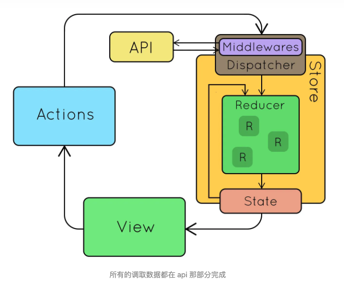

# 状态管理

文档

- 使用示例[state-management](https://github.com/cloudyan/state-management)

状态库

- redux
  - redux-thunk
  - redux-saga
  - redux toolkit
- dva
- valtio
- vuex
- pinia

## redux



## redux-thunk vs redux-saga

- [redux-thunk 和 redux-saga 的区别？](https://zhuanlan.zhihu.com/p/126481634)
- https://medium.com/@shoshanarosenfield/redux-thunk-vs-redux-saga-93fe82878b2d

首先 thunk 来源自 think 的”过去式“ -- 作者非常特别的幽默感。主要意思就是声明一个函数来代替表达式，这样就可以将执行求值操作（evaluation）延迟到所需要的时刻。

```js
// calculation of 1 + 2 is immediate
// x === 3
let x = 1 + 2;

// calculation of 1 + 2 is delayed
// foo can be called later to perform the calculation
// foo is a thunk!
let foo = () => 1 + 2;
```

redux-thunk

之所以需要使用 Redux-Thunk 等中间件，是因为 Redux store 只支持同步数据流。

```js
// 普通 action
export function toggleTodo(index) {
  return { type: TOGGLE_TODO, index }
}

// redux-thunk 的 action 可以是一 异步的 higher order function 高阶函数
export const fetchData = args => async (dispatch, getState) => {
  const state = getState();
  const url = 'https://jsonplaceholder.typicode.com/users/' + args;

  try {
    const response = await fetch(url)
      .then(resp => {
        return resp;
      })
      .then(resp => resp.json());

    dispatch({
      type: REMOTE_DATA_RECEIVED,
      data: response
    });
  } catch (error) {
    console.log(error);
  }
};
```

redux-saga

Redux-Saga 是一个旨在使应用程序副作用（例如，异步操作，如获取数据）更易于处理和更高效执行的库。

saga 使用的仍然是普通的 action

```js
// 这个 action 将由 saga 监听，并且出发 side effect 异步加载 api 操作
export const fetchData = () => ({
  type:  "START_FETCH_DATA"
});

// 这个 action 将由 saga 发出
export const fetchSuccess = data => ({
  type: "REMOTE_DATA_RECEIVED",
  payload: data
});
```

接下来就是注册 saga 相关 side effect 操作。下面的文件是 fetchData.saga.js

```js
import { takeLatest, put } from "redux-saga/effects";

function* fetchDataSaga(action){
  try {
    const response = yield fetch(action.url);
    const data = yield response.json()
    yield put(fetchSuccess(data));
  } catch (error) {
    console.log(error);
  }
}

export default function* watchFetchSaga(){
  // saga 将监听此事件，takeLatest 表示仅仅只监听最新的此事件
  yield takeLatest("START_FETCH_DATA", fetchDataSaga)
}
```

与 Redux Thunk 相比，Redux Saga 的好处是您可以更轻松地测试应用程序内部的异步数据流。

对比：

redux-thunk | redux-saga
----------- | ----------
动作创建者可能持有太多异步逻辑函数 | 动作创造者保持纯粹的功能
包含较少的样板代码              | 包含比 Redux-Thunk 更多的样板代码
难以扩展代码                   | 与 redux-thunk 代码相比，易于扩展代码
难以测试异步函数                | 易于测试，因为所有异步逻辑都保持在一起
与 redux-saga 相比，易于理解的逻辑、功能、概念 | 由于生成器函数、redux-saga effects等要学习的概念比较多，理解起来比较困难。

下面是两个版本实现的相同示例。

```js
// redux-thunk 版本
import * as types from '../constants/ActionTypes'

export function receiveBooks(data) {
  return {
    type: types.REVEIVE_BOOKS,
    books: data.books,
    categories: data.categaries,
    genres: data.genres,
  }
}

export function fetchBooks() {
  return dispatch => {
    fetch('/books.json').then(response => {
      const data = response.json()
      dispatch(receiveBooks(data))
    }).catch(error => {
      dispatch({type: types.FETCH_FAILED, error})
    })
  }
}
```

```js
// redux-saga 版本
import { takeLatest } from 'redux-saga'
import { call, put } from 'redux-saga/effects'

function* fetchBooks(path) {
  try {
    const data = yield call(fetch, patch)
    yield put({type: 'REVEIVE_BOOKS', data})
  } catch(err) {
    yield put({type: 'FETCH_FAILED', message: err.message})
  }
}

function* fetchSaga() {
  yield* takeLatest('FETCH_BOOKS', fetchBooks);
}

export default fetchSaga;
```

与 Redux-Thunk 相比，Redux-Saga 的好处是您可以避免回调地狱，这意味着您可以避免传入函数并在内部调用它们。此外，您可以更轻松地测试异步数据流。call 和 put 方法返回 JavaScript 对象。因此，您可以通过相等比较简单地测试 saga 函数产生的每个值。另一方面，Redux-Thunk 返回更难测试的承诺。测试 thunk 通常需要对 fetch api、axios 请求或其他函数进行复杂的模拟。使用 Redux-Saga，您不需要模拟用效果包装的函数。这使得测试干净、可读且更易于编写。

然而，Redux-Thunk 非常适合小型用例和初学者。thunk 的逻辑都包含在函数内部。
