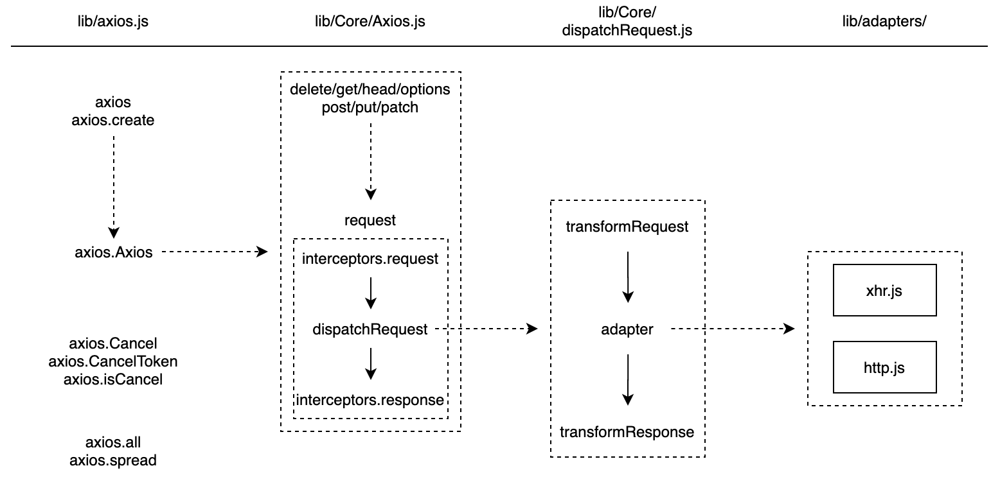
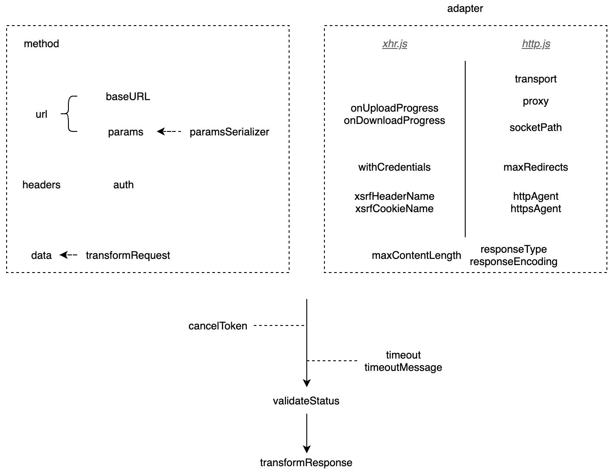

# axios

Axios 是一个基于 promise 网络请求库，作用于node.js 和浏览器中。 它是 [isomorphic](https://www.lullabot.com/articles/what-is-an-isomorphic-application) 的(即同一套代码可以运行在浏览器和node.js中)。在服务端它使用原生 node.js http 模块, 而在客户端 (浏览端) 则使用 XMLHttpRequests。

axios 是最著名的 Javascript 请求库之一。

- https://www.npmjs.com/package/axios
- https://github.com/axios/axios


阅读源码前应详细阅读 [axios 官方文档](https://axios-http.com/docs/intro), 以及 README.md 说明文件。

之前就看过一次源码, 当时感觉设计精良，其他的也没了, 前些日子需要做请求拦截重试功能, 同时又看了一遍 axios 以及 umi-request 的设计, 才感觉 axios 的这个设计，兼容扩展都十分强大.

参考好文

- 官方文档: https://axios-http.com/docs/intro
- 推荐 [You-Dont-Know-Axios](https://github.com/chinesedfan/You-Dont-Know-Axios)
- 若川 [学习 axios 源码整体架构，打造属于自己的请求库](https://juejin.cn/post/6844904019987529735)
- [77.9K Star 的 Axios 项目有哪些值得借鉴的地方](https://juejin.cn/post/6885471967714115597)\

### 设计理论



### 请求配置



请求体结构设计

```js
// { method, url, headers, data }
axios({
  baseURL: 'http://a.com/b?c=d',
  url: '&e=f'
})
```


## 目标

- [utils](./utils.md)
- 使用及场景
- 源码分析
- Axios 生态
- 功能扩展

## 源码分析

通读源码后，可以浏览下 axios 的 Issues 以及 PR，数量不少，甚至可以尝试解决。

项目文件内容比较多，涉及以下内容。

1. [Axios 分层架构](###设计理论)
2. 适配器设计：适配思想, 其增强思路还可实现如下功能
   1. 接口数据缓存
   2. 请求节流
   3. 请求失败重发机制
   4. 取消重复请求
3. 拦截器设计
   1. axios 的拦截器的由注册->编排->执行三部分组成
   2. 任务管理、编排与执行
4. 转换器设计, 数据校验与转换
   1. axios 做了大量的此类工作
5. 响应结构设计
6. 取消请求设计
7. 数据安全 CSRF 防御
   1. 跨站请求伪造（Cross-site request forgery）
8. 工具方法 helpers


调用流程：初始化Axios——> 注册拦截器 ——> 请求拦截——> ajax请求 ——> 响应拦截 ——> 请求响应回调

### 适配器设计

如何实现一个适配器，可以参看 [axios/adapters/README.md](https://github.com/axios/axios/blob/master/lib/adapters/README.md#axios--adapters)

具体实现参见官方的两个适配器 xhr.js 和 http.js

```js
var settle = require('axios/lib/core/settle');

module.exports = function myAdapter(config) {
  // At this point:
  //  - config has been merged with defaults
  //  - request transformers have already run
  //  - request interceptors have already run

  // Make the request using config provided
  // Upon response settle the Promise

  return new Promise(function(resolve, reject) {

    // example
    // var requestData
    // var request = new XMLHttpRequest();

    var response = {
      data: responseData,
      status: request.status,
      statusText: request.statusText,
      headers: responseHeaders,
      config: config,
      request: request
    };

    settle(resolve, reject, response);

    // From here:
    //  - response transformers will run
    //  - response interceptors will run
  });
}
```

通过此设计，还可以实现

- 小程序的请求适配器
- fetchAPI 的请求适配器

### 拦截器设计

参考[设计理论](###设计理论), 对比以下示例，非常容易理解拦截器的大体设计

```js
axios.interceptors.request.use(requestResolve1, requestReject1);
axios.interceptors.request.use(requestResolve2, requestReject2);
axios.interceptors.response.use(responseResolve1, responseReject1);
axios.interceptors.response.use(responseResolve2, responseReject2);

axios(config).then(thenBlock).catch(catchBlock);

// equals to

Promise.resolve(config)
  .then(requestResolve2, requestReject2)
  .then(requestResolve1, requestReject1)
  .then(dispatchRequest, undefined)
  .then(responseResolve1, responseReject1)
  .then(responseResolve2, responseReject2)
  .then(thenBlock).catch(catchBlock);
```

注意：

The real request is not sent immediately when you call `axios(config)`, because `dispatchRequest` is one of `then` handlers. Avoid doing synchronous time-consumed tasks after axios calls.

```js
// 有点类似如下的写法
axios(config);

setTimeout(function () {
  // do time-consumed tasks in next event loop
});

// 所以，避免在 axios 调用后做同步耗时的任务
```

浏览器在重定向时总是会添加 `Authorization` 标头，参见[axios/axios#2855 (comment)](https://github.com/axios/axios/issues/2855#issuecomment-732974809)

那么拦截器怎么实现的呢

核心代码逻辑在这里 https://github.com/axios/axios/blob/master/lib/core/Axios.js#L95~L117

### 转换器设计

从[架构设计](###设计理论)上清晰的看到转换器是适配器前后最近的数据处理层

- config.transformRequest
- config.transformResponse

默认设置在 defaults.js 中，具体参见 https://github.com/axios/axios/blob/master/lib/defaults.js#L54

### 响应结构设计

一个请求的响应包含以下信息。

```js
{
  // `data` 由服务器提供的响应
  data: {},

  // `status` 来自服务器响应的 HTTP 状态码
  status: 200,

  // `statusText` 来自服务器响应的 HTTP 状态信息
  statusText: 'OK',

  // `headers` 是服务器响应头
  // 所有的 header 名称都是小写，而且可以使用方括号语法访问
  // 例如: `response.headers['content-type']`
  headers: {},

  // `config` 是 `axios` 请求的配置信息
  config: {},

  // `request` 是生成此响应的请求
  // 在node.js中它是最后一个ClientRequest实例 (in redirects)，
  // 在浏览器中则是 XMLHttpRequest 实例
  request: {}
}
```

这样设计，内容丰富，适配性很强，包含

- http 状态数据
- header 内容
- 请求体内容
- 以及响应数据

很多人封装接口响应的数据，仅保留了响应数据，其他数据给丢掉，认为提供了最简模式，但事实上在有特定的诉求时，就无法适配，比如

- 出现了特定的数据格式，需要特定处理
- 请求失败想重试，结果没有请求体相关配置内容
- 特定结果需特殊处理，没有 http 状态数据可用

这里就需要注意：

> 拦截器不要返回数据，依然返回这个 AxiosResponse 对象

### 取消请求设计

axios 使用 cancel token 取消一个请求。（已弃用，推荐使用 `AbortController`）

> Axios 的 cancel token API 是基于**可取消 Promise 提案（[cancelable promises proposal](https://github.com/tc39/proposal-cancelable-promises)）**来实现的（该提案已被撤销） 。
> 此 API 从 `v0.22.0` 开始已被弃用，不应在新项目中使用。
> 从 `v0.22.0` 开始，Axios 支持以 fetch API 方式 —— `AbortController` 取消请求

具体使用参看文档[取消请求](https://axios-http.com/zh/docs/cancellation)

注意: axios 可以使用同一个 cancel token 取消多个请求。

关于 [cancelable promises](https://github.com/whatwg/fetch/issues/447) 提案已撤销

核心逻辑在这里 https://github.com/axios/axios/blob/master/lib/core/dispatchRequest.js#L12

### 数据安全 CSRF 防御

Axios 内部是使用 **双重 Cookie 防御** 的方案来防御 CSRF 攻击，利用CSRF攻击不能获取到用户Cookie的特点。

```js
  xsrfCookieName: 'XSRF-TOKEN',
  xsrfHeaderName: 'X-XSRF-TOKEN',
```

详细参见 https://github.com/axios/axios/blob/master/lib/adapters/xhr.js#L145

### 工具方法 helpers

- 处理浏览器的 polyfill
- 管理 cookie
- 解析 HTTP 头

## Axios 生态

数据来源 https://github.com/axios/axios/blob/master/ECOSYSTEM.md

- 通用
  - axios-methoe-override
  - axios-cache-plugin
  - [axios-fetch](https://www.npmjs.com/package/axios-fetch)
    - [@apollo/client](https://www.npmjs.com/package/@apollo/client)
  - [axios-jsonp](https://www.npmjs.com/package/axios-jsonp)
    - `jsonpAdapter`
  - [axios-retry](https://www.npmjs.com/package/axios-retry)
    - `axiosRetry(client, { retries: 3 })`
  - [axios-extensions](https://www.npmjs.com/package/axios-extensions)
  - [axios-auth-refresh](https://www.npmjs.com/package/axios-auth-refresh)
  - [axios-jwt](https://www.npmjs.com/package/axios-jwt)
- 记录和调试
  - axios-response-logger
  - [axios-debug-log](https://www.npmjs.com/package/axios-debug-log)
  - [axios-curlirize](https://www.npmjs.com/package/axios-curlirize)
- 单元测试
  - axiosist
  - [axios-mock-adapter](https://github.com/ctimmerm/axios-mock-adapter)
  - mocha-axios
- React 和 Redux
  - axios-hooks
  - react-hooks-axios
  - redux-axios-middleware

- 其他
  - [ky](https://www.npmjs.com/package/ky) 基于 Fetch API, 支持现代浏览器和Deno
    - Node.js，请查看 [Got](https://github.com/sindresorhus/got)
    - 同构需求，请查看 [ky-universal](https://www.npmjs.com/package/got)
  - [node-libcurl](https://www.npmjs.com/package/node-libcurl)
  - [superagent](https://www.npmjs.com/package/superagent)

这里有几个，还是非常实用的

## 知识点

- Should `method` be lower cases or upper?
  - **都应大写**，参看[HTTP specifications](https://developer.mozilla.org/en-US/docs/Web/HTTP/Methods)
- headers: CORS, cookies
  - [CORS](https://developer.mozilla.org/en-US/docs/Web/HTTP/CORS) 仅发生在浏览器端
  - [preflighted requests](https://developer.mozilla.org/en-US/docs/Web/HTTP/CORS#Preflighted_requests)
  - [Access-Control-Expose-Headers](https://developer.mozilla.org/en-US/docs/Web/HTTP/CORS#Access-Control-Expose-Headers)
  - [Access-Control-Allow-Origin](https://developer.mozilla.org/en-US/docs/Web/HTTP/CORS#Credentialed_requests_and_wildcards)
  - Set-Cookie [HttpOnly or Secure](https://developer.mozilla.org/en-US/docs/Web/HTTP/Cookies#Secure_and_HttpOnly_cookies)
- `data` && `Content Type`
  - `data` must match with the header [Content Type](https://developer.mozilla.org/en-US/docs/Web/HTTP/Headers/Content-Type)
    - `text/plain` -> data 是文本
    - `application/json` -> data 应是 JSON 格式（使用 `JSON.stringify` 转换）
    - `application/x-www-form-urlencoded` -> data 应是 URL/URI 编码的, 可以使用 `qs.stringify(data)` 转换
- `responseType`
  - text
  - json
  - arraybuffer
  - document
  - blob
  - stream
- axios 目前还不支持 [Fetch API](https://developer.mozilla.org/en-US/docs/Web/API/Fetch_API)
- 跟随重定向 [follow-redirects](https://github.com/follow-redirects/follow-redirects)
- validateStatus
- 304 响应 [sindresorhus/got](https://github.com/sindresorhus/got/blob/main/documentation/cache.md)
- [应用传输安全 (ATS)](https://developers.google.com/admob/ios/app-transport-security)

## 扩展


### Promise 链式写法

使用 Promise 链式写法的一个缺点是我们无法访问每个回调函数的作用域（或者其中未返回的的变量），你可以阅读 Alex Rauschmayer 博士这篇 [a great article](https://2ality.com/2017/08/promise-callback-data-flow.html) 来解决这个问题。


参考：

- [代码沙盒，能运行多种语言，且可以添加依赖](https://codesandbox.io/)
- [Axios部分源码解析--拦截器](https://github.com/AttemptWeb/Record/issues/26)
- [不要再被误导了，封装 Axios 只看这一篇文章就行了](https://juejin.cn/post/7053471988752318472)
- [前端安全系列（二）：如何防止CSRF攻击？](https://tech.meituan.com/2018/10/11/fe-security-csrf.html)
